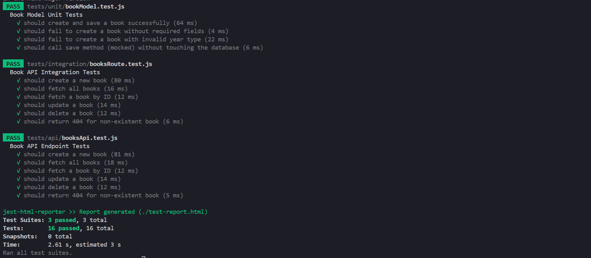
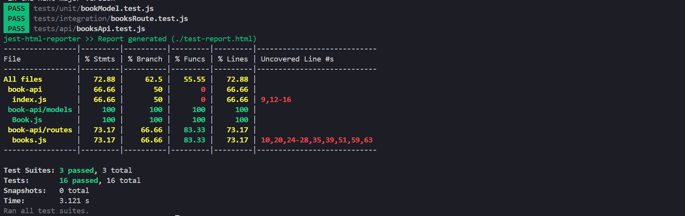
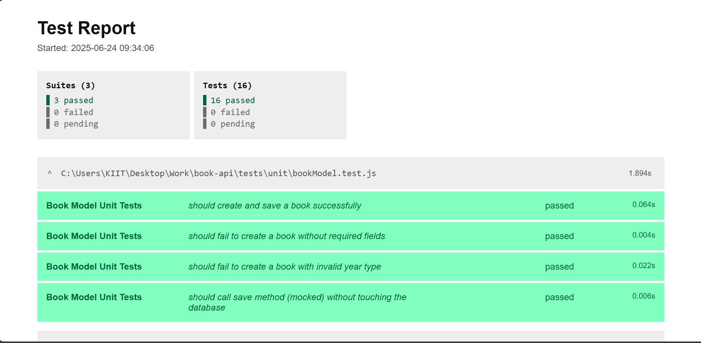
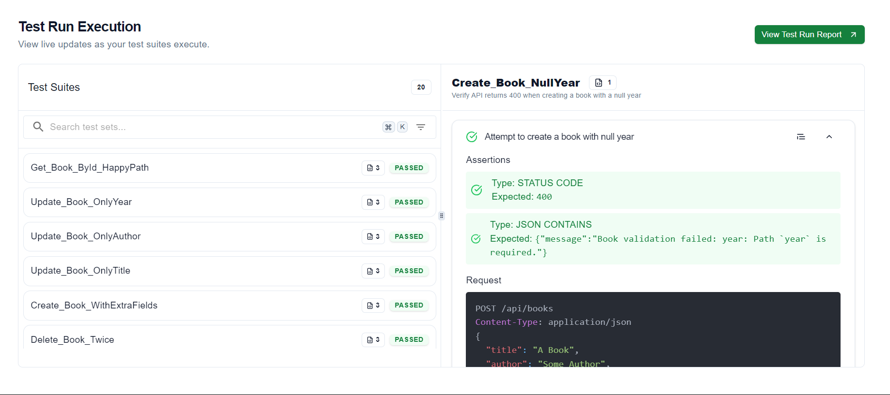

# 📚 Book Manager API

A simple full-stack Book Management application built with **Node.js**, **Express**, **MongoDB (Mongoose)**, and a basic **HTML/CSS/JS frontend**. This project allows you to add, view, edit, and delete books through both a RESTful API and a clean user interface.

---

## 🚀 Features

- ✅ **Create, Read, Update, Delete** books  
- 🧾 **Bulk insert support**  
- 🎨 **Simple UI** for managing books  
- 🔧 **RESTful API** with clear structure  
- 🧪 **Comprehensive Testing** (unit, integration, and API)

---

## 📁 Folder Structure

```

book-api/
├── models/
│   └── Book.js
├── routes/
│   └── books.js
├── frontend/
│   ├── index.html
│   ├── style.css
│   └── script.js
├── tests/
│   ├── unit/
│   │   └── bookModel.test.js
│   ├── integration/
│   │   └── booksRoutes.test.js
│   └── api/
│       └── booksApi.test.js
├── index.js
├── package.json
├── .gitignore
├── README.md
└── docs/
└── API.md

````

---

## 🔧 Setup Instructions

### 1. Clone the Repository

```bash
git clone https://github.com/medhavisahgal/book-api.git
cd book-api
````

### 2. Install Dependencies

```bash
npm install
```

Here's the section written in Markdown format for your README:

---

### 3. Configure MongoDB Connection (Using Environment Variable)

Create a `.env` file in the project root:

```env
MONGODB_URI=mongodb+srv://<username>:<password>@cluster0.mongodb.net/<your-database-name>?retryWrites=true&w=majority
```

> 🔒 **Important:** Do **NOT** commit this file to GitHub. Ensure it is listed in your `.gitignore`.

In `index.js`, load the environment variables by adding:

```js
require('dotenv').config();
```

Then connect to MongoDB using:

```js
mongoose.connect(process.env.MONGODB_URI, {
  useNewUrlParser: true,
  useUnifiedTopology: true
});
```

> ✅ **Note:** Make sure your IP address is whitelisted in [MongoDB Atlas](https://cloud.mongodb.com/).

---


### 4. Run the Backend Server

```bash
node index.js
```

Server runs at: [http://localhost:3000](http://localhost:3000)

### 5. Open the Frontend

Open `public/index.html` directly in your browser or use the **Live Server** extension in VS Code.

---

## 🧪 Testing

This project includes complete test coverage using **Jest** and **Supertest**.

### ✅ Test Output (Terminal)


### 📊 Code Coverage Report


### 🧾 HTML Test Report

### 🧪 Test Types:

* **Unit Tests** (`tests/unit/bookModel.test.js`)
  Test the Book schema/model functionality in isolation.

* **Integration Tests** (`tests/integration/booksRoutes.test.js`)
  Test the Express route handlers and their interaction with the database.

* **API Tests** (`tests/api/booksApi.test.js`)
  End-to-end testing of the RESTful API using HTTP assertions.
  
## 🧪 Keploy API Testing

This project was tested using the **[Keploy](https://keploy.io/)** platform to simulate and validate API calls.

### ✅ Keploy API Test Report



### 🧪 Run All Tests:

```bash
npm test
```

---

## 📖 API Documentation

Full API reference with request/response samples is available in [`docs/API.md`](docs/API.md).

---

## 🙋 Author

Created by **Medhavi Sahgal**

